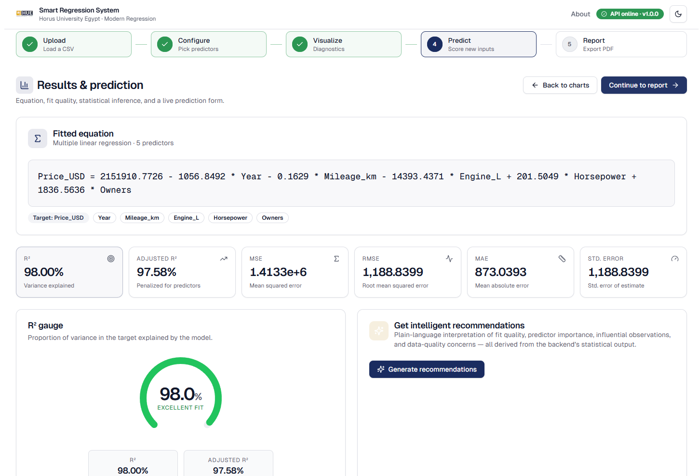
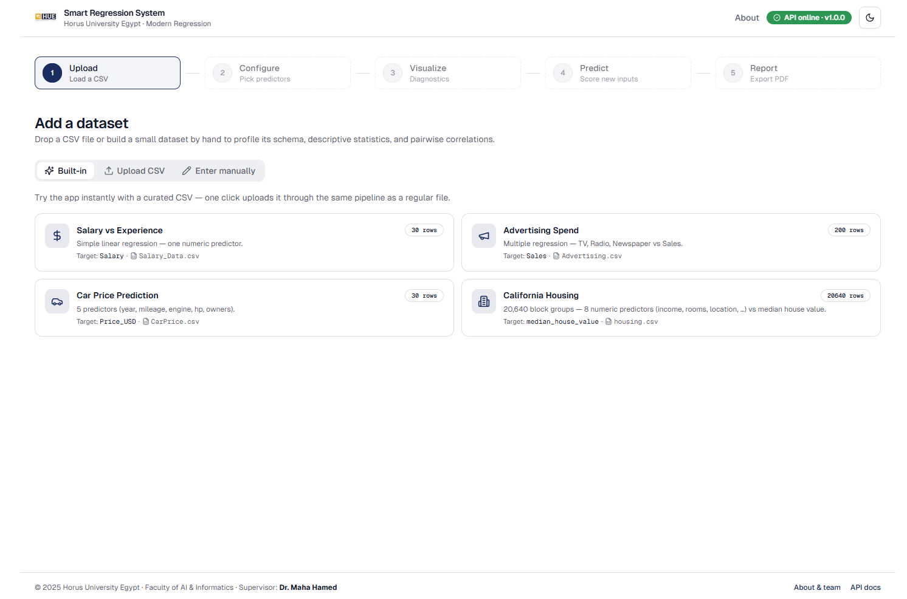
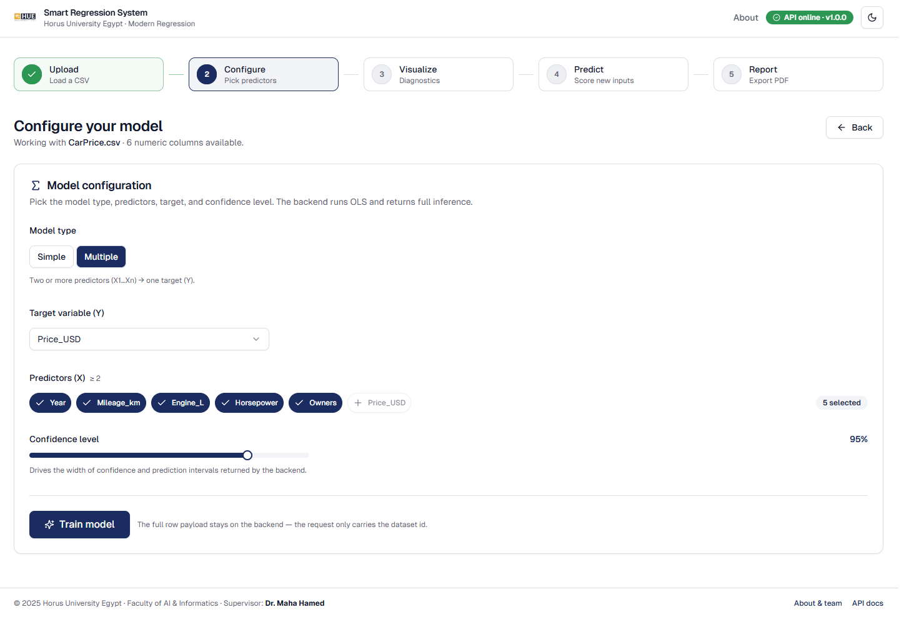
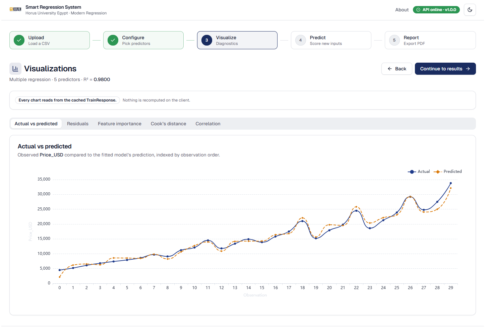

# Smart Regression & Data Insight System

> A production-grade reimagining of a **Modern Regression** course project at
> **Horus University Egypt — Faculty of AI & Informatics**.
> Implements **Simple & Multiple Linear Regression** with full statistical
> inference (Least-Squares Estimation, ANOVA, t-tests, 95 % confidence
> intervals, residual diagnostics) — delivered through a **FastAPI** backend
> and a **Next.js 14** dashboard.

<p align="center">
  
</p>

<p align="center">
  <a href="#"></a>
  <a href="#"></a>
  <a href="#"></a>
  <a href="#"></a>
  <a href="#"></a>
  <a href="#"></a>
</p>

---

## Live demo

| | URL |
|---|---|
| 🌐 **Frontend** | [modern-regression-project.vercel.app](https://modern-regression-project.vercel.app) |
| ⚙️ **API Docs** | [smart-regression-backend.onrender.com/docs](https://smart-regression-backend.onrender.com/docs) |

> The backend runs on Render's free tier — the first request after ~15 min of
> inactivity may take 30–60 s to wake up.


## Why this project

Most "regression apps" you'll find online stop at `sklearn.LinearRegression()
.fit().predict()`. This one is built like a **real product**:

- **The backend is the only source of statistical truth.** The frontend never
  computes R², MSE, or t-stats — it just renders what FastAPI returns. That
  rule alone eliminates an entire class of "the chart and the table disagree"
  bugs.
- **Every coefficient comes with a confidence interval and a p-value.**
  ANOVA, t-tests, F-statistic, residual diagnostics — all wired up.
- **Diagnostic plots that statisticians actually use:** Actual-vs-Predicted,
  Residuals-vs-Fitted, Cook's distance for influence detection, correlation
  heatmap, feature importance.
- **Plain-English recommendations.** A rule engine reads the metrics and
  emits human-readable suggestions ("Cook's distance flags row 47 as high
  influence — consider re-running without it").
- **Print-ready PDF report** generated server-side with ReportLab.
- **44 automated tests** (unit + integration + Playwright E2E) all green.

---

## Features

### Statistics

- Ordinary Least Squares — closed-form `(XᵀX)⁻¹ Xᵀy`, NumPy / SciPy.
- **Inference:** standard errors, t-stats, two-sided p-values, 95 % CIs for
  every coefficient.
- **ANOVA decomposition:** SST = SSR + SSE, F-statistic, model p-value.
- **Goodness of fit:** R², adjusted R², MSE, RMSE.
- **Diagnostics:** residuals, leverages, Cook's distance, normality of
  residuals, multicollinearity warning when predictors are correlated.
- Singular-matrix detection with a clear, actionable error code.

### Workflow (5 guided steps)

| Step | What you do |
|---|---|
| **1 — Add data** | Drag-and-drop a CSV **or** type a small dataset in the manual-entry tab. Handles `,` `;` `\t` separators automatically. |
| **2 — Configure** | Pick target Y, one or more predictors X, Simple/Multiple → **Train**. |
| **3 — Visualize** | Six interactive ECharts: scatter + regression line, actual vs predicted, residuals, feature importance, Cook's distance, correlation heatmap. |
| **4 — Results** | Equation, animated R² gauge, ANOVA table, t-tests, prediction form, **Generate recommendations**. |
| **5 — Report** | Print-ready HTML at `/report?model=<id>` and a server-generated PDF. |

### Built-in sample datasets

Click any of these in the upload panel — no file picker needed:

| Dataset | Rows | Target | Use case |
|---|---|---|---|
| `Salary_Data.csv` | 30 | `Salary` | Simple linear regression. |
| `Advertising.csv` | 200 | `Sales` | Classic 3-predictor multiple regression. |
| `housing.csv` | 20,640 | `median_house_value` | California housing — 8 numeric predictors. |
| `CarPrice.csv` | 30 | `Price_USD` | Hand-curated multi-predictor demo. |

---

## Architecture

```
┌──────────────────────────────────────┐        ┌─────────────────────────────┐
│  Frontend  (Next.js 14, App Router)  │  HTTP  │  Backend  (FastAPI)         │
│                                      │ ─────▶ │                             │
│  • Tailwind + shadcn/ui              │        │  • pandas / numpy / scipy   │
│  • Zustand (in-memory only)          │  JSON  │  • In-memory dataset/model  │
│  • TanStack Query v5 (HTTP cache)    │ ◀───── │    registries (no DB)       │
│  • ECharts (lazy-loaded)             │        │  • ReportLab → PDF export   │
│  • Framer Motion (R² gauge only)     │        │                             │
└──────────────────────────────────────┘        └─────────────────────────────┘
                       localhost:3000  ─▶  localhost:8000/api/v1
```

**Design rules baked into the code:**

- The backend is the **only** place that does math. The frontend renders.
- **No persistence.** Datasets and models live in process-memory; close the
  tab and they're gone. This is intentional for a course demo — easier to
  reason about, no migration headaches.
- Every chart is `next/dynamic({ ssr: false })` so the ~400 kB ECharts bundle
  stays out of the First Load JS budget.
- The frontend ships a **typed API client** generated from the FastAPI Pydantic
  schemas (no manual `fetch` calls in components).

---

## Tech stack

**Backend** — Python 3.12 · FastAPI · Pydantic v2 · NumPy · SciPy · pandas ·
ReportLab · pytest

**Frontend** — Next.js 14 (App Router) · TypeScript 5 · Tailwind CSS ·
shadcn/ui · TanStack Query v5 · Zustand · React Hook Form + Zod ·
ECharts · Framer Motion · Vitest · MSW · Playwright

---

## Quick start

> Full instructions including troubleshooting & port-conflict recovery are in
> [`HOW_TO_RUN.md`](./HOW_TO_RUN.md).

**Prerequisites:** Python **3.12** (avoid 3.13/3.14 — scientific wheels lag),
Node.js **18+**, npm **9+**.

### Option A — One-click launcher (recommended)

Double-click **`start.bat`** (Windows) or run **`./start.sh`** (macOS/Linux)
from the repo root. It will:

1. Create a Python virtual environment (first run only)
2. Install backend & frontend dependencies
3. Start both servers in separate terminal windows
4. Open `http://localhost:3000` in your browser automatically

```powershell
.\start.bat        # Windows — double-click or run from terminal
./start.sh         # macOS / Linux
```

### Option B — Manual (two terminals)

```powershell
# Terminal 1 · Backend
cd backend
py -3.12 -m venv venv
.\venv\Scripts\Activate.ps1
pip install -r requirements.txt
python -m uvicorn main:app --reload --port 8000

# Terminal 2 · Frontend
cd frontend
npm install
npm run dev
```

Open <http://localhost:3000> — the header shows a **green dot** when the
backend on `:8000` is reachable.

---

## Repository layout

```
.
├── backend/                  FastAPI app
│   ├── main.py               app factory · CORS · error handlers
│   ├── routers/              /health · /datasets · /models
│   ├── schemas/              Pydantic request/response models
│   ├── services/             OLS · diagnostics · PDF report
│   ├── state.py              in-memory dataset & model registries
│   └── tests/                pytest suite
├── frontend/                 Next.js 14 dashboard
│   ├── app/                  App Router routes (/, /report, /about)
│   ├── components/           shadcn/ui + project widgets
│   ├── hooks/                TanStack Query hooks (one per endpoint)
│   ├── lib/                  api client · query client · types
│   ├── store/                Zustand workflow store (no persist)
│   ├── public/samples/       bundled CSVs served statically
│   └── tests/                Vitest unit + integration · Playwright E2E
├── csv_test/                 sample datasets (also mirrored in frontend/public)
├── HOW_TO_RUN.md             full local runbook + troubleshooting
├── start.bat / start.sh      one-click launcher (both servers)
└── README.md                 this file
```

---

## API reference (cheat-sheet)

Base URL: `http://localhost:8000/api/v1` — Swagger UI at `/docs`.

| Method | Path | Purpose |
|---|---|---|
| `GET`  | `/health` | Liveness probe (frontend polls this for the header dot). |
| `POST` | `/datasets` | Upload a CSV; returns `dataset_id`, schema, profile. |
| `GET`  | `/datasets/{id}` | Re-read a cached dataset profile. |
| `POST` | `/models/train` | Fit OLS; returns coefficients, ANOVA, diagnostics, model_id. |
| `GET`  | `/models/{id}` | Re-read a trained model. |
| `POST` | `/models/{id}/predict` | Predict from a JSON row of feature values. |
| `GET`  | `/models/{id}/report.pdf` | Server-rendered PDF report. |

All errors return a structured payload: `{ "code": "singular_matrix",
"message": "...", "details": { ... } }`. The frontend translates the
`code` into a friendly toast.

---

## Testing

```powershell
# Backend
cd backend
pytest

# Frontend — 44 tests, all MSW-mocked, no backend required
cd frontend
npm run test          # Vitest unit + integration
npm run test:e2e      # Playwright happy-path (needs backend on :8000)
npm run build         # asserts 250 kB First Load JS budget
```

| Suite | Tests | Type |
|---|---|---|
| `tests/unit/*` | 24 | workflow store · formatters · recommendations rules |
| `tests/integration/*` | 20 | typed API client · forms · MSW |
| `tests/e2e/happy-path.spec.ts` | 1 | Upload → Train → Predict → Report |

---

## Screenshots

| | |
|:---:|:---:|
| **Step 1 — Add data**<br/> | **Step 2 — Configure**<br/> |
| **Step 3 — Visualize**<br/> | **Step 4 — Results**<br/> |

---

## Academic context

- **University:** Horus University Egypt (HUE) — Faculty of AI & Informatics
- **Course:** Modern Regression
- **Supervisor:** Dr. Maha Hamed
- **Team Lead:** Alaa Saber Mohamed
- **Year:** 2026

The full team of 10 students is credited on the in-app
[`/about`](frontend/app/about/page.tsx) page.

---

## Contributing

This started as a course project, but PRs that improve the **statistical
correctness**, **accessibility**, or **test coverage** are welcome. Please:

1. Run `npm run lint && npm run type-check && npm run test` (frontend) and
   `pytest` (backend) before opening a PR.
2. Don't add a new statistic to the frontend without first exposing it in the
   backend response schema.
3. Don't add `persist` middleware to the Zustand store — the in-memory
   constraint is intentional.

---

## License

MIT — see [`LICENSE`](./LICENSE) (add one if you publish publicly).

---

<p align="center">
  <sub>
    © 2026 Horus University — Egypt · Faculty of AI &amp; Informatics
    · Supervisor: <strong>Dr. Maha Hamed</strong>
  </sub>
</p>
